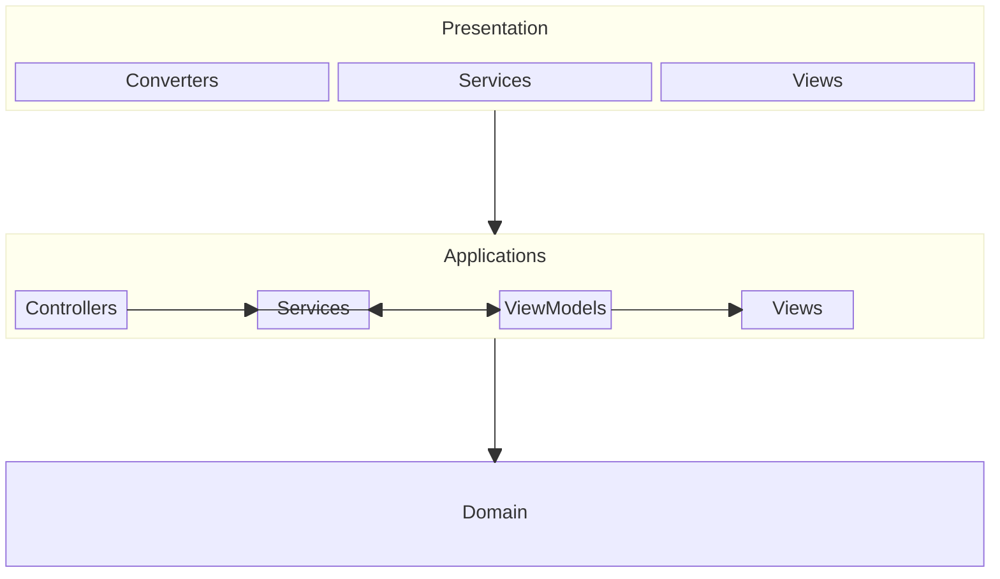

```mermaid
block
  columns 1
  block:P["Presentation\n\n\n"]
    columns 3
    space:3
    P_C["Converters"]
    P_S["Services"]
    P_V["Views"]
  end
  space
  block:A["Applications\n\n\n"]
    columns 8
    space:8
    A_C["Controllers"]
    space
    A_S["Services"]
    space
    A_VM["ViewModels"]
    space
    A_V["Views"]
  end
  space
  D["Domain"]

  P --> A
  A --> D
  A_C --> A_S
  A_C --> A_VM
  A_VM --> A_S
  A_VM --> A_V
```
