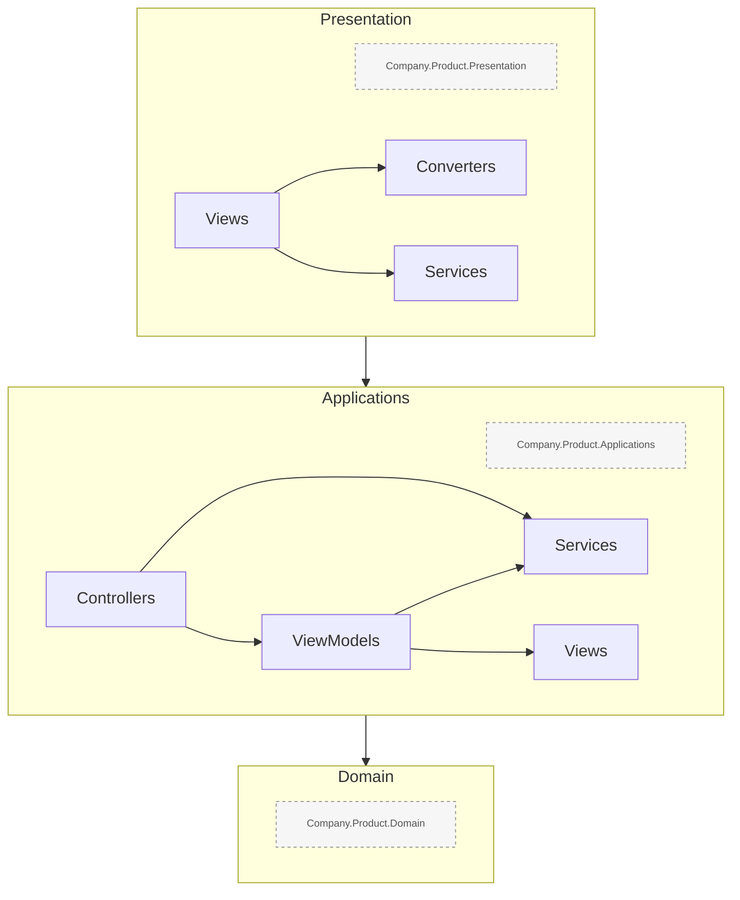

```mermaid
flowchart TB

  subgraph P["Presentation"]
    direction LR
    P_NS["Company.Product.Presentation"]:::meta
    P_C["Converters"]
    P_S["Services"]
    P_V["Views"]
  end

  subgraph A["Applications"]
    direction LR
    A_NS["Company.Product.Applications"]:::meta
    A_C["Controllers"]
    A_S["Services"]
    A_VM["ViewModels"]
    A_V["Views"]
  end

  subgraph D["Domain"]
    direction LR
    D_NS["Company.Product.Domain"]:::meta
  end

  P --> A
  A --> D

  P_V --> P_C
  P_V --> P_S

  A_C --> A_S
  A_C --> A_VM
  A_VM --> A_S
  A_VM --> A_V

  classDef meta fill:#f6f6f6,stroke:#999,stroke-dasharray: 3 3,color:#555,font-size:10px;
```
